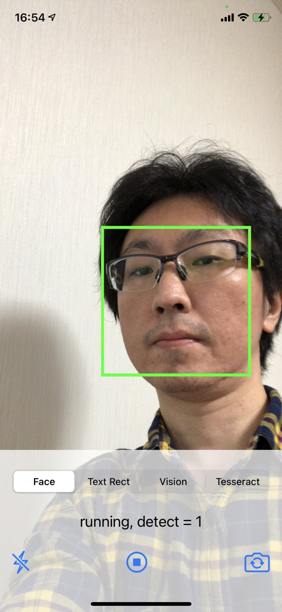
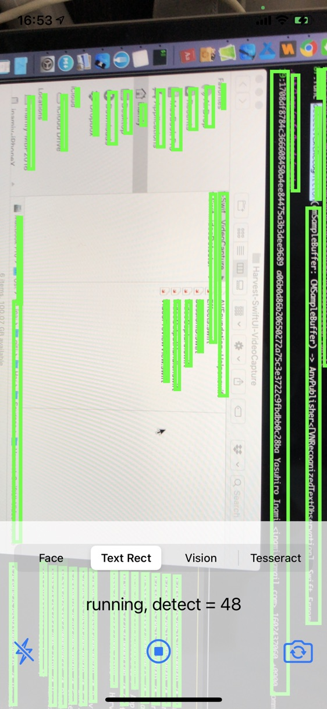
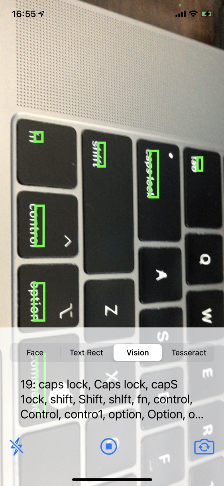
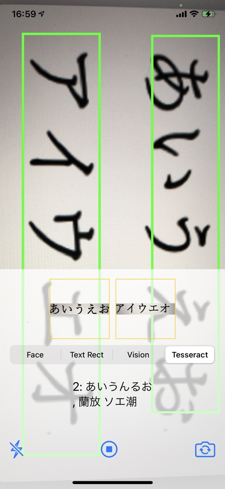

# Harvest-SwiftUI-VideoDetector

📹 Video image/text recognizers written in SwiftUI + Harvest + iOS Vision + SwiftyTesseract.

## Examples

| Face (iOS Vision) | Text Rect (iOS Vision) |
|---|---|
|  |  |

| Text Recognition (iOS Vision) | Text Recognition (Tesseract, Japanese) |
|---|---|
|  |  |

### Caveats & 🆘 Need Help!

- There is a weird **codesign issue** where app can't get installed without adding `codesign --force` in Run Script as a workaround, so **try build & device-install several times** even Xcode may prompt install error.
- Text recognition works for landscape mode only (need help for portrait detection!)
- Tesseract 4.0.0 + Japanese text recognition is super slow & poor at the moment.

## License

[MIT](LICENSE)